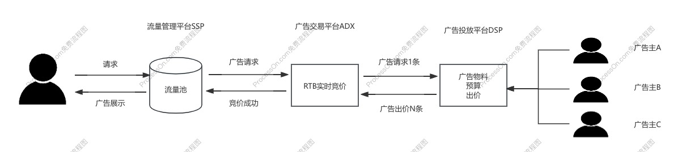

## 广告相关指标  

| 指标名称 | 指标含义 | 计算方式 | 应用场景 |
|---------|---------|----------|----------|
| CTR(点击率) | 广告展示后被点击的概率 | 点击数/总展示数 | 评估广告吸引力 |
| CVR(转化率) | 点击广告后完成转化的概率 | 转化数/点击数 | 衡量广告效果 |
| ROI(投资回报率) | 广告投入产出比 | 收益/成本 | 评估广告价值 |
| CPM(千次展示成本) | 每千次展示的费用 | 总费用/(展示量/1000) | 计费方式 |
| CPC(每次点击成本) | 每次点击的费用 | 总费用/总点击量次数 | 计费方式  |
| CPA(每次行动成本) | 每次行动的费用 | 总费用/转化次数 | 计费方式  |
| CPT(按时收费) | 按时收费  | 固定位置固定时间按时收费 | 计费方式  |
| OCPM(优化千次展示成本) | 优化后的千次展示成本,会考虑转化目标转化效果 | (实际展示次数 / 1000) * 智能竞价价格 | 计费方式  |
| UV(独立访客) | 访问用户数 | 去重后的用户数 | 衡量覆盖人群 |
| PV(页面浏览量) | 页面被浏览次数 | 总浏览次数 | 流量评估 |

## 广告相关术语
| 名称 | 含义 |  
|---------|---------|
| Generalized Second Price (广义第二价格) | 广告竞价机制,在竞价过程中赢家按照次高价收费 |
|  DAU | 日活跃用户数 |
| 广告库存 | 平台所有流量中可用于展示广告的总量,通常通过Ad-load广告加载率来调节 |
| ADX(Ad Exchange)广告交易平台 | 通常基于实时竞价完成广告位资源的展示 |
| SSP(Supply Side Platform)供应方平台 | 主要服务于发布商,用于发布管理/出售广告位和对接ADX平台 |
| DSP(Demand Side Platform)需求方平台 | 主要服务于广告主代理商用于购买广告库存 |
| 广告填充率 | 广告返回数/广告请求数 |
| 广告曝光率 | 素材曝光数/广告请求数 受广告位置/加载速度/相关性等多因素影响 |

## 出价方式
| 名称 | 含义 |  
|---------|---------|
| nobid(最大转化) | 无成本约束的出价方式,平台在消耗完全部预算的前提下尽可能帮客户拿到更多的转化  |
| Bid-Cap  | 设置竞价上限,最终出价取决于系统出价和出价上限的最小值 |
| Cost-Cap |  成本上限 平台会按照设定的值去匹配,这个时候有可能会存在某次出价高于设定值的场景  |

### 详解OCPX
从CPM到OCPM主要在于广告主的投放诉求变化
* 广告主想计算总体投入的ROI,那就需要结合转化率等数据综合评估
* 平台侧并不好通过非即时数据统计收益,一些数据依赖广告主回传的时候容易被hack
#### 为什么会有OCPX
相对于CPM或者CPC,OCPX能更好兼顾广告平台收益和广告主的ROI,相比传统CPM(CPC)
* 计费点和出价点分离  OCPX广告主出价在深度转化上,计费是按照曝光或者点击计费
* 按预估收费 收费按照预估CPM或者预估CPC收费 所以会存在广告超成本赔付情况
* OCPX广告主可以表达更多的转化目标,可以做到更精细化投放.从平台流量来说通过预估CPM竞价保证流量价值

#### OCPX出价
广告平台通过实时预估广告主每次曝光的转化概率，并根据广告主设置的转化出价，在广告主可以接受的转化成本范围进行智能调控出价

广告系统的实时出价=平台预估eCPM= 客户出价 * pCVR(转化率预估) * pCTR(点击率预估) * 智能调控因子(根据客户预算、转化成本动态调整出价)

#### OCPX收费
出价点与计费点分离 按照展示收费

#### OCPX预估过程
在广告竞价阶段,平台需要计算出每个广告的实际价值eCPM,在eCPM的计算中就需要考虑pCVR、pCTR、智能调控因子等,pCVR/pCTR存在预估不准确的情况,因此通过将投放阶段进行拆分
* 一阶段可以理解为学习积累数据阶段,这个阶段结算跟普通的CPC区别不大
* 二阶段通过跑出来的预估值 在出价上尽量接近广告主的出价

## 广告展现的流程
  

在ADX实时竞价中主要会有以下的过程
1. 过滤 过滤无效或者不合格的广告请求,比如无效流量过滤或者内容过滤等
2. 定向 对广告请求进行定向 
3. 召回 召回是指从广告库存或广告库中提取与广告请求相关的广告候选项。召回的目的是初步筛选出一批可能适合展示的广告，以便在下一步进行排序和进一步筛选。
4. 粗排 粗排是对召回的广告候选项进行初步筛选和排序的过程。粗排的目标是通过相对简单和快速的算法，筛选出一部分满足基本要求的广告，从而减少后续精排阶段的计算量
5. 精排 精排是对通过粗排筛选出的广告进行更详细和精细的排序过程。精排通常使用复杂的算法和模型，以最大化广告的效果和收益。
6. 竞胜 竞胜的广告将得到展示,会结合竞价和广告质量得分得出AdRank

对于一些大的SSP,广告交易平台ADX有这两种玩法:
* 当平台广告流量无法打满的时候,可以通过接入三方ADX来扩充广告主.简单理解京东有对应的DSP平台,在京东的DSP投放的广告可以展示到快手上.
* 整个小媒体流量.主要因为小媒体无自建DSP等.大平台又有流量优势.简单理解你在快手投放广告有一定概率投放到一个不知名的app上(手动狗头)

## 广告类型
广告类型可以按照不同的维度去划分

### 按投放位置划分
* 开屏广告
* 搜索广告
* 直播广告
* 信息流广告

### 按广告产品形式

#### 竞价广告

#### 合约广告  
合约广告有广告位合约和展示量合约两种方式
* 广告位合约指媒体与广告主在约定的某一段时间内在某些广告位固定投放广告的广告形式.结算方式是CPT(按时收费)
* 展示量合约广告主与发布商签订合同,购买一定数量的广告展示次数.结算方式按照约定好的CPM(每千次展示费用)

#### 程序化交易广告
#### 原生广告 

## 参考