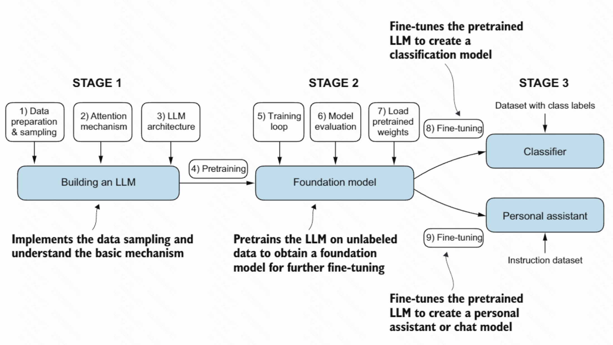
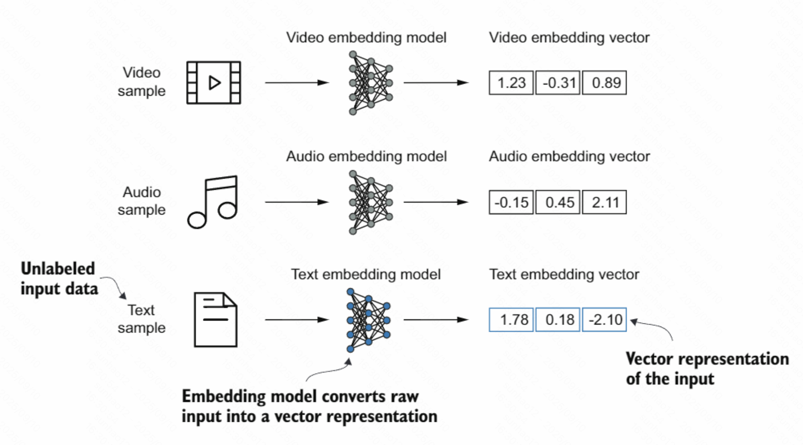
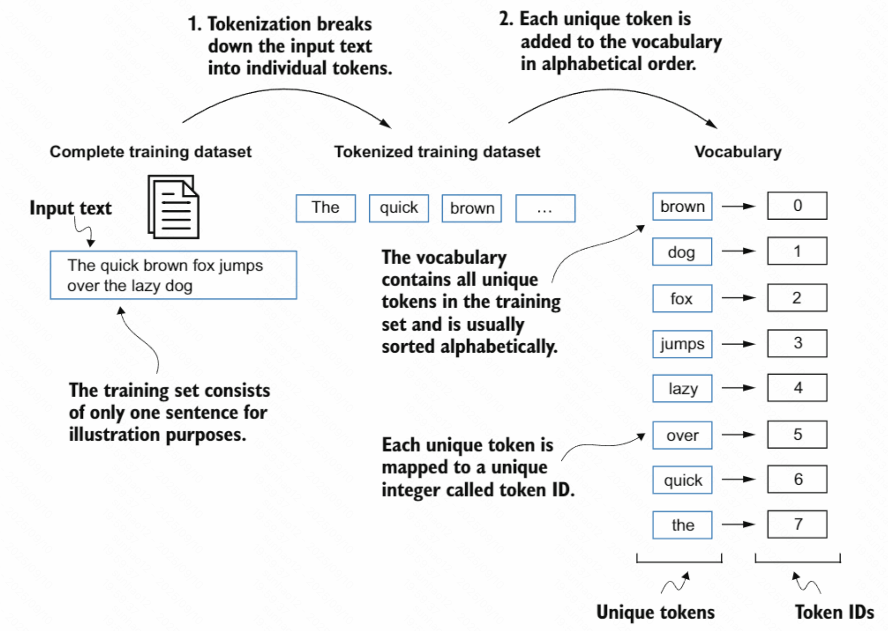
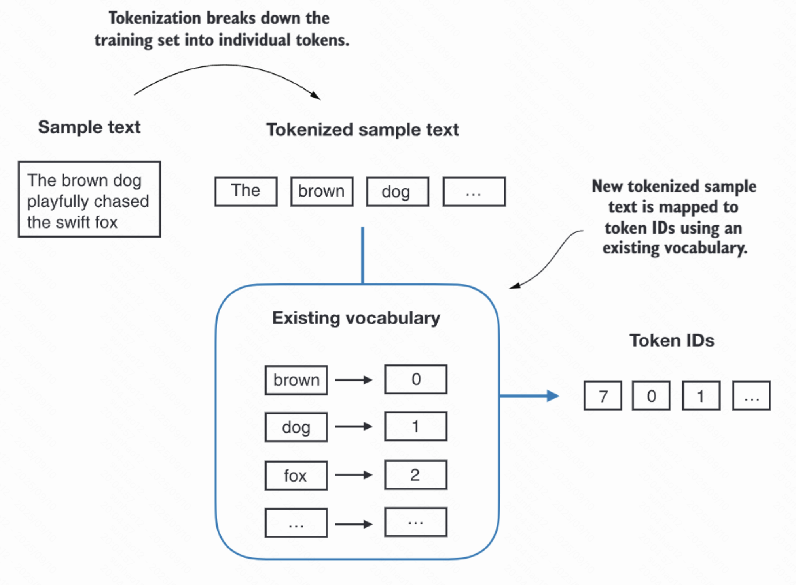

* 实现LLM 的架构并完成数据准备流程
* 预训练 LLM 以得到基座模型
* 在基座模型上进行微调，使其成为个人助手或文本分类器。

Embedding(嵌入): 是把离散对象映射到稠密向量空间的过程或机制,嵌入的主要目的是把非数值型数据转换成神经网络可处理的数值表示。
Embedding model(嵌入模型):指专门将输入（文本/图像/音频/ID 等）映射为稠密向量表示的模型，用于度量语义相似、检索、聚类与下游任务特征输入。

1. Tokenized text-把原始文本按规则切成更小的单位(token)，如词、子词、字符或标点。
2. 将获取的Token结合vocabulary(词表/词汇表)转换成Token IDs

3. 将token转成嵌入向量。
