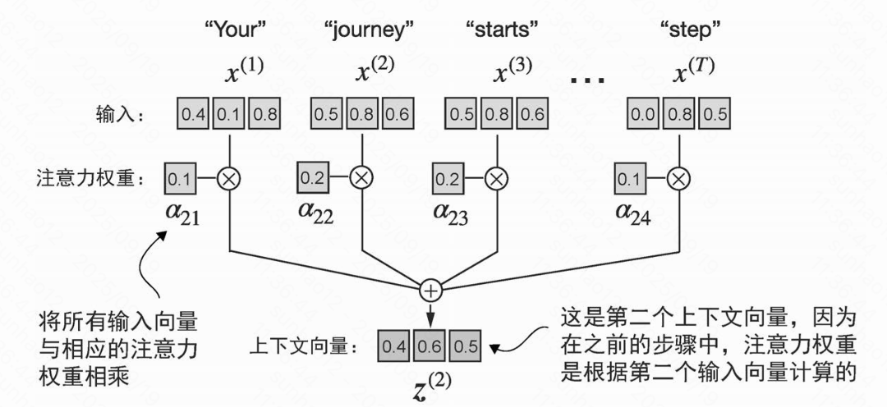

## 长序列建模问题

### 1. 信息传递衰减
- **问题描述**:在RNN等序列模型中,前序token通过"隐藏状态"向后传递信息
- **衰减原因**:梯度消失问题,信息在长距离传播中逐渐丢失
- **影响**:难以捕获长距离依赖关系,影响模型理解能力

### 2. 局部视野局限
- **CNN模型限制**:通过堆叠卷积层可以扩大感受野,但存在以下问题:
  - 计算成本随层数指数增长
  - 全局关联信息缺失
  - 感受野扩大有限,难以处理超长序列

### 3. 计算效率瓶颈
- **时间复杂度问题**:
  - RNN:O(n) 顺序处理,无法并行化
  - CNN:需要大量层数才能捕获长距离依赖
  - 传统注意力:O(n²) 复杂度,序列长度翻倍计算量增加4倍
- **内存消耗**:注意力矩阵大小与序列长度平方成正比
- **实际影响**:处理长文档、长对话时速度显著下降

## 自注意力机制实现

### 没有可训练权重的简单自注意力机制

* 计算当前词元与其他词元的注意力分数(通过点积,度量向量相似度的一种方式)
* 通过归一化得到注意力权重
* 依次计算所有词元的上下文向量(context vector,可以理解为序列中包含了所有元素信息的嵌入向量)

### 缩放点积注意力(scaled dot-product attention)

## 参考
[Transformer 里的 Q K V 是什么](https://blog.cnbang.net/tech/3934/)
[Transformer模型详解(图解最完整版)](https://zhuanlan.zhihu.com/p/338817680)
[李宏毅 Transformer讲解](https://www.youtube.com/watch?v=ugWDIIOHtPA&list=PLJV_el3uVTsOK_ZK5L0Iv_EQoL1JefRL4&index=61)

