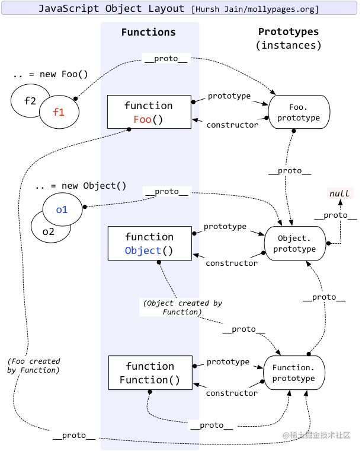

## 进程和线程

1. 进程是操作系统资源调度的基本单位，线程是任务的调度执行的基本单位
2. 线程共享所属进程的资源，因此共享简单，但是同步复杂，需要用加锁等措施

## 函数节流

### 防抖函数

```javascript

// debounce 多次触发只有最后一次执行   当前连续触发轮次等待时间
// debounce：支持首击立即触发（immediate），且始终有尾随触发；可选最长等待（maxWait）
function debounce(fn, delay, { immediate = false, maxWait = 0 } = {}) {
  let timer = null
  let burstStart = 0
  let lastArgs, lastThis
  let reallyImmediate = immediate
  return function debounced(...args) {
    const now = Date.now()
    lastArgs = args
    lastThis = this
    if (burstStart === 0) burstStart = now

    // 命中最长等待：立刻执行，并重置本轮
    if (maxWait && now - burstStart >= maxWait) {
      burstStart = 0
      // 这里需要清空timer
      clearTimeout(timer)
      timer = null
      return fn.apply(lastThis, lastArgs)
    }

    const shouldCallNow = reallyImmediate && timer == null

    clearTimeout(timer)

    // 尾随触发：总是在最后一次输入后的 delay 执行一次
    if(!shouldCallNow) {
        timer = setTimeout(() => {
          burstStart = 0
          timer = null
        fn.apply(lastThis, lastArgs)
      }, delay)
    }
    

    // 首击立即触发：仅在新一轮开始且 immediate=true 时
    if (shouldCallNow) {
      reallyImmediate = false
      // 这里不需要设置burstStart
      return fn.apply(lastThis, lastArgs)
    }
  }
}
```

### 节流

```javascript
// 多长时间必须执行对应的函数
// 需要注意时间处理那块
function throttle(func, t = 50) {
  let lastRunTime = null
  let timer = null
  return function (...args) {
    const now = +new Date()
    const context = this
    if (!lastRunTime) {
      lastRunTime = now
    }
    
    clearTimeout(timer)
    
    if (now - lastRunTime >= t) {
      lastRunTime = now
      return func.apply(context, args)
    } else {
      const remaining = lastRunTime + t - now
      timer = setTimeout(() => {
        lastRunTime = +new Date()
        func.apply(context, args)
      }, Math.max(remaining, 0)) // 确保不为负数
    }
  }
}
```

### 深拷贝

```javascript

function deepClone(obj, hash = new Map()) {
  if (obj === null || typeof obj !== 'object') return obj

  if (hash.get(obj)) return hash.get(obj)
  
  if (obj instanceof Date) return new Date(obj)
  if (obj instanceof RegExp) return new RegExp(obj)
  if (obj instanceof Map) {
    const cloneMap = new Map()
    hash.set(obj, cloneMap)
    obj.forEach((value, key) => {
      cloneMap.set(deepClone(key, hash), deepClone(value, hash))
    })
    return cloneMap
  }
  if (obj instanceof Set) {
    const cloneSet = new Set()
    hash.set(obj, cloneSet)
    obj.forEach(value => {
      cloneSet.add(deepClone(value, hash))
    })
    return cloneSet
  }
  
  let cloneObj = new obj.constructor()
  hash.set(obj, cloneObj)
  
  // 处理普通属性和 Symbol 属性
  Reflect.ownKeys(obj).forEach(key => {
    cloneObj[key] = deepClone(obj[key], hash)
  })
  
  return cloneObj
}
```

## 模拟async await的实现过程

```javascript
// 通过Promise Generator来实现
function spawn(genF) {
  return new Promise((resolve, reject) => {
    const itr = genF()
    function step(nextFn) {
      let next
      try {
        next = nextFn()
      } catch (e) {
        return reject(e)
      }
      
      if (next.done) {
        return resolve(next.value)
      }
      
      Promise.resolve(next.value).then(
        function (v) {
          step(function () {
            return itr.next(v)
          })
        },
        function (e) {
          step(function () {
            return itr.throw(e)
          })
        }
      )
    }
    step(function () {
      return itr.next(undefined)
    })
  })
}
```

## 实现apply call bind

### apply

```javascript
Function.prototype.myApply = function (context, args) {
  context = context || window
  const fn = Symbol('fn')
  context[fn] = this
  const result = context[fn](...args)
  delete context[fn]
  return result
}
```

### call

```javascript
// call的性能更好 不需要处理参数转换
Function.prototype.myCall = function (context, ...args) {
  context = context || window
  const fn = Symbol('fn')
  context[fn] = this
  const result = context[fn](...args)
  delete context[fn]
  return result
}
```

### bind

```javascript
Function.prototype.myBind = function (context, ...args) {
  const fn = this
  const boundFn = function (...restArgs) {
    if (this instanceof boundFn) {
      return new fn(...args, ...restArgs)
    } else {
      return fn.apply(context, args.concat(restArgs))
    }
  }
  
  // 保持原型链  注意
  boundFn.prototype = Object.create(fn.prototype)
  
  return boundFn
}
```

## 理解new操作符

1. 以构造器的原型创建新对象
2. 将新对象作为this调用构造器
3. 如果构造器返回的是对象则返，否则返回第一步创建的对象

### 实现一个new

```javascript
function myNew(Con, ...args) {
  const obj = Object.create(Con.prototype)
  const ret = Con.call(obj, ...args)
  
  // 更严格的类型检查：只返回对象或 null/undefined
  if ((typeof ret === 'object' || typeof ret === 'function') && ret !== null) {
    return ret
  }
  return obj
}
// 创建出来对象的__proto__ 是函数Con的prototype

//  __proto__ 对象的原型 指向构造函数的prototype 属性
// prototype 是函数对象的一个属性  Func.prototype.constructor === Func
// 对象属性的获取是顺着对象__proto__沿着原型链查找

// 构造函数 Function          实例对象 Object
// +---------------+          +---------------+
// |               |          |               |
// |   prototype   |--------->|   __proto__   |
// |               |          |               |
// +---------------+          +---------------+

function Foo() {}
// Foo是一个函数对象 是通过Function.prototype => function Function() {} 构造出来的
// 注意理解下面的几个 在理解一下这里
Foo.__proto__ === Function.prototype
Foo.prototype.__proto__ === Object.prototype
Foo.prototype.constructor === Foo
Foo.prototype.__proto__.__proto__ === null
```



## 原型链面试问题

```javascript
    // 需要再理解一下这里
    Function.prototype.a = () => console.log(1);
    Object.prototype.b = () => console.log(2);
    function A() {}
    console.log(A.__proto__ === Function.prototype) // true
    console.log(Object.__proto__ === Function.prototype) //true
    const a = new A();
    a.a(); // 无法执行 原型链顺序 A.prototype (__proto__) => Object.prototype (__proto__) => null
    a.b();

    // https://juejin.cn/post/6844903839070421000

    function Function() {}
    Function.prototype (__proto__) => Object.prototype

    // 构造函数的__proto__(包括Function和Object)都指向Function.prototype。
    // 对象的__proto__都指向Object.prototype
```

## 实现继承的几种方式

### 原型链继承

```javascript
//原型链继承 将子类的原型指向父类的一个实例实现继承
// 会导致父类的属性被所有实例所共享

function Parent(age) {
  this.age = age
}
function Child(name) {
  this.name = name
}

Child.prototype = new Parent()
Child.prototype.constructor = Child
```

### 借用构造函数方式

```javascript
// 借用构造函数方式都在父类的构造函数中定义 需要创建一遍无法复用
function Parent(age) {
  this.name = age
  this.getName = () => {
    return this.name
  }
}
function Child(age) {
  // 这里需要call ***
  Parent.call(this, age)
}
```

### 组合继承

```javascript
// 组合继承 将原型链和借用构造函数技术结合在一起
function Parent(age) {
  this.name = age
}
function Child(age, name) {
  Parent.call(this, age)
  this.name = name
}

Child.prototype = new Parent()
Child.prototype.constructor = Child
// 原型链上存在多余的属性
// 调用两次构造函数
```

### 寄生组合式继承

```javascript
function Animal(name) {
  this.name = name
}

function Cat(name, age) {
  // 别忘了这里的借用构造函数 这里需要注意
  Animal.call(this, name)
  this.age = age
}

Cat.prototype = Object.create(Animal.prototype, {
  constructor: {
    value: Cat,
    enumerable: false,
    writable: true,
    configurable: true,
  },
})
```

## 数组操作

```javascript
    function isArray(obj) {
      return Object.prototype.toString.call(obj) === '[object Array]';
    }
    // 数组的相关方法
    unshift(value) 在前面插入  shift() 在前面移除
    // 数组扁平化
    function flattenDeep(arr) {
      return arr.reduce((acc, val) => {
        if(Array.isArray(val)) {
          return  acc.concat(flattenDeep(val));
        } else {
          return acc.concat(val)
        }
      }, [])
    }
```

## 实现compose/pipe函数

```javascript
// compose 函数执行顺序是从右往左
function compose(...funcs) {
  if (funcs.length === 0) {
    return (arg) => arg
  }
  if (funcs.length === 1) {
    return func[0]
  }
  return funcs.reduce(
    (a, b) =>
      (...args) =>
        a(b(...args))
  )
}
// pipe函数
function pipe(...funcs) {
  if (funcs.length === 0) {
    return (arg) => arg
  }

  if (funcs.length === 1) {
    return funcs[0]
  }

  return function (...args) {
    let result = funcs[0](...args)

    for (let i = 1; i < funcs.length; i++) {
      result = funcs[i](result)
    }

    return result
  }
}
```

## curry函数

```javascript
function curry(fn) {
  return function curried(...args) {
    // 如果参数够了，直接执行
    if (args.length >= fn.length) {
      return fn.apply(this, args)
    }

    // 参数不够，返回新函数 这里需要理解下
    return function (...moreArgs) {
      // apply
      return curried.apply(this, args.concat(moreArgs))
    }
  }
}
```

### 实现一个jsonp

```javascript
function jsonp(url, params, callback) {
  return new Promise((resolve, reject) => {
    const script = document.createElement('script')
    const callbackName = `jsonp_${new Date().getTime()}`
    const searchParams = new URLSearchParams(params)
    searchParams.append('callback', callbackName)
    
    const timeout = setTimeout(() => {
      cleanup()
      reject(new Error(`JSONP request to ${url} timed out`))
    }, 5000)
    
    const cleanup = () => {
      if (script.parentNode) {
        script.parentNode.removeChild(script)
      }
      delete window[callbackName]
      clearTimeout(timeout)
    }
    
    window[callbackName] = (data) => {
      cleanup()
      resolve(data)
    }
    
    script.onerror = () => {
      cleanup()
      reject(new Error(`JSONP request to ${url} failed`))
    }
    
    script.src = `${url}?${searchParams.toString()}`
    document.head.appendChild(script)
  })
}
```

## promise

### promise值穿透

then 和 catch 期望接收函数做参数，如果非函数就会发生 Promise 穿透现象，打印的是上一个 Promise 的返回

```javascript
const promise = new Promise(function (resolve, reject) {
  setTimeout(function () {
    resolve(1)
  }, 3000)
})

promise.then(2).then((n) => {
  console.log(n) // 输出1
})
```

### promsie相关api

Promise.all 返回一个Promise 当所有的Promsie都成功的时候才会fulfilled,任何一个被拒绝Promise.all会被
立刻拒绝返回那个最先被拒绝的原因
Promise.allSellted 返回一个Promsie 所有Promise都有结果的时候返回 数组中每个对象包含 status: fulfilled/rejected
value: 返回的值 reason: 原因
Promise.any 任何一个fulfilled就返回解决的Promise 所有都失败的时候 AggregateError: All promises were rejected
Promise.race 被第一个有状态的promise结果决定整个Promise状态

```javascript
// 实现一个Promise.All
function promiseAll(promises) {
  return new Promise((resolve, reject) => {
    // 参数校验
    if (!Array.isArray(promises)) {
      return reject(new TypeError('promises must be an array'))
    }

    const results = []
    let completed = 0
    const len = promises.length

    // 处理空数组情况
    if (len === 0) {
      return resolve(results)
    }

    promises.forEach((promise, index) => {
      Promise.resolve(promise)
        .then((result) => {
          results[index] = result
          completed++

          if (completed === len) {
            resolve(results)
          }
        })
        .catch(reject) // 任何一个Promise失败都会直接reject
    })
  })
}
```

## js中0.1 + 0.2 !== 0.3的问题

JavaScript使用Number类型表示数字(整数和浮点数)，遵循 IEEE 754 标准 通过64位来表示一个数字

```javascript
function add(a, b) {
  const factor =
    10 **
    Math.max((a.toString().split('.')[1] || '').length, (b.toString().split('.')[1] || '').length)
  return (a * factor + b * factor) / factor
}
```

## 相关题

```javascript
// 可以按照路径进行排序 先处理短路径 在处理长路径
function parseObj(obj) {
  const ret = {}
  
  // 按路径长度排序，短路径优先处理
  const sortedEntries = Object.entries(obj).sort((a, b) => 
    a[0].split('.').length - b[0].split('.').length
  )
  
  for (const [key, value] of sortedEntries) {
    const arr = key.split('.')
    let prev = ret
    
    for (let i = 0; i < arr.length; i++) {
      if (i < arr.length - 1) {
        // 检查路径冲突
        if (prev[arr[i]] !== undefined && typeof prev[arr[i]] !== 'object') {
          console.warn(`路径冲突: ${key} 与已存在的值 ${prev[arr[i]]} 冲突，跳过此路径`)
          break
        }
        
        if (!prev[arr[i]]) {
          prev[arr[i]] = {}
        }
        prev = prev[arr[i]]
      } else {
        // 最后一个键
        if (prev[arr[i]] !== undefined && typeof prev[arr[i]] === 'object') {
          console.warn(`路径冲突: ${key} 会覆盖已存在的对象`)
        }
        prev[arr[i]] = value
      }
    }
  }
  
  return ret
}
```

```javascript
// 实现类似koa中间件的处理逻辑
function onionMiddle(...middlewares) {
  return (next) => {
    let index = -1
    function dispatch(i) {
      if (i <= index) throw new Error('next() called multiple time')
      index = i
      let fn = middlewares[i]
      if (i === middlewares.length) fn = next
      if (!fn) return Promise.resolve()
      return Promise.resolve(fn(() => dispatch(i + 1)))
    }
    return dispatch(0)
  }
}
```

```javascript
// 实现lodash的get方法
function customGet(obj, path, defaultValue) {
  if (obj === null) {
    return defaultValue
  }
  // 将路径字符串转换为路径数组
  const pathArray = Array.isArray(path) ? path : path.split('.')
  let result = object
  // 遍历路径数组，逐层获取属性值
  for (let i = 0; i < pathArray.length; i++) {
    if (result === null) {
      // 如果中途遇到 undefined 或非对象值，则返回默认值
      return defaultValue
    }
    result = result[pathArray[i]]
  }

  // 返回获取到的属性值或默认值
  return result === undefined ? defaultValue : result
}
```

实现一个foo函数 奇数次调用返回1 偶数次调用返回2

```javascript
// 立即执行表达式
const foo = (function () {
  let count = 0

  return function () {
    count++
    return count % 2 === 1 ? 1 : 2
  }
})()

// 函数属性
function foo() {
  foo.count = (foo.count || 0) + 1
  return foo.count % 2 === 1 ? 1 : 2
}
```

```javascript
class LazyManClass {
  constructor(name) {
    this.addTask(() => {
      console.log(`Hi! This is ${name}!`)
    })
    this.runTask()
    return this
  }

  sleep(time) {
    this.addTask(() => {
      return new Promise((resolve) => {
        setTimeout(() => {
          console.log(`等待了${time}秒...`)
          resolve()
        }, time * 1000)
      })
    })
    return this
  }

  eat(food) {
    this.addTask(() => {
      console.log(`Eat ${food}`)
    })
    return this
  }

  addTask(task) {
    this.taskArr.push(task)
  }

  taskArr = []

  async runTask() {
    for (const task of this.taskArr) {
      await task()
    }
  }
}

function LazyMan(name) {
  return new LazyManClass(name)
}

LazyMan('John').sleep(3).eat('dinner')
```
